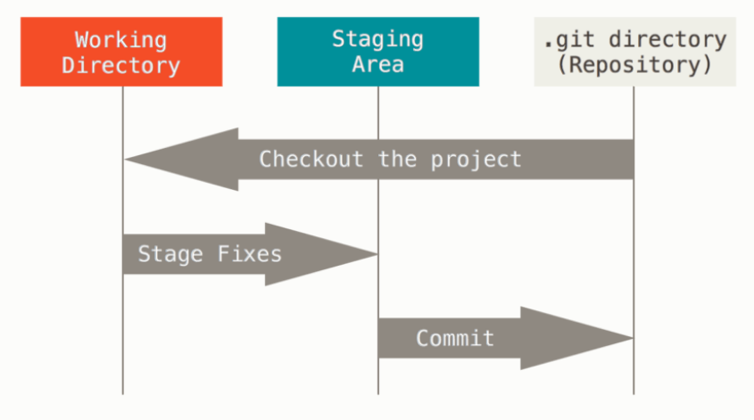

# 一文读懂如何在Windows上使用git

## 1.什么是git

​	   git是一个开源的分布式版本控制系统，可以有效、高速地处理从很小到非常大的项目版本管理。版本控制系统指的是一种记录一个或者若干文件内容变化，以便将来查阅特定版本修订情况的系统。

​	    既然它是一个开源的分布式版本控制系统，那么什么是版本控制系统？它有什么好处呢？举个例子，你完成了一个项目，但是在进行测试的时候发现了一个小bug，当你花了一整天时间，自认为大功告成的时候，却发现软件都无法运行了，于是你非常烦躁，想要回到修改之前的状态，但是自己都不记得改动了哪些地方，于是只有默默的删库跑路。但是如果你使用了git，那就不一样了，它可以很方便的让你保存之前的状态，并在需要的时候还原，这就是版本控制系统的好处了。

​    	那为什么它是分布式呢？分布式是相对于集中式而言，集中式的版本库是集中存放在中央服务器的，干活的时候要先从中央服务器取得最新的版本，然后开始干活，干完活了，再把自己的活推送给中央服务器。可想而知，在网络拥挤的情况下这将会消耗大量的时间，而且中央服务器一旦挂了并且没有备份......分布式版本控制系统中根本没有“中央服务器”，每个人的电脑上都是一个完整的版本库，这样，你工作的时候，就不需要联网了，因为版本库就在你自己的电脑上。既然每个人电脑上都有一个完整的版本库，那多个人如何协作呢？比方说你在自己电脑上改了文件A，你的同事也在他的电脑上改了文件A，这时，你们俩之间只需把各自的修改推送给对方，就可以互相看到对方的修改了。和集中式版本控制系统相比，分布式版本控制系统的安全性要高很多，因为每个人电脑里都有完整的版本库，某一个人的电脑坏掉了不要紧，随便从其他人那里复制一个就可以了。

​		

## 2.下载安装git

### 2.1 下载

​	可以直接在官网下载，但速度比较慢

[Git官网]: https://git-scm.com/downloads/	"界面如下图"


### 2.2 安装

​	下载完成后，就可以对git进行安装了。它安装起来很方便，一路点击Next就可以。打开Git Bash出现下面的界面，恭喜你安装成功了


## 3. git基础

### 3.1 git的三种状态

​		想要学好git，必须从它的基础学起。git中的所有文件，只有三种状态，分别是**已修改（modified）**、**已暂存（staged）**和**已提交（committed）**

- 已修改表示修改了文件，但还没保存到数据库中。

- 已暂存表示对一个已修改文件的当前版本做了标记，使之包含在下次提交的快照中。

- 已提交表示数据已经安全地保存在本地数据库中。

  git三种状态的文件怎么储存呢？它们都位于同一区域吗？答案是否定的。与之对应的是git的三个阶段，它们分别是工作区、暂存区以及git目录。如下图所示：
  
  
  
- 工作区：工作区是对项目的某个版本独立提取出来的内容，放在磁盘上供我们使用。

- 暂存区：暂存区一般在git仓库目录中，在git中的专业术语叫做“索引”，它保存了下次要提交的文件信息列表。工作区添加(add)的文件将保存在暂存区。

- git仓库：git仓库是用来保存项目的元数据和对象数据库的地方，它是git中最重要的部分。从其他计算机克隆仓库时，复制的就是这里的数据。

  讲了这么多概念，在我们平常使用git时，它们的状态是怎么对应的呢？

  ​       如果 Git 目录中保存着特定版本的文件，就属于 已提交 状态。如果文件已修改并放入暂存区，就属于已暂存状态。 如果自上次检出后，作了修改但还没有放到暂存区域，就是 已修改状态。 举个例子，平常在git目录下工作的时候，如果我们新创建一个文件，那它就是属于Untracked状态，修改一个已存在的文件，它将处于Modified状态，它们都属于工作区，也就是说，我们平时工作都是在工作区进行的。当我们执行添加（Add）指令，该文件将被放入暂存区，暂存区的文件可以通过提交（commit）指令将其放入git仓库，这是文件就被稳妥的保存了。

## 4. git使用方法

### 4.1 运行git前的配置

​		git安装完成后，我们需要对它进行系统配置。我刚开始学git的时候，看到很多人配置git都是用

```g
git config --global
```

那为什么要在后面加一个global呢？是不是必须用global？其实不然。在git中，git config是git自带的一个工具，它可以为git的外观和行为配置变量，它包含三个级别的配置，分别是system、global和local,在git中若要配置它们，得在git config指令后传递不同的选项，分别为

```
System:   git config --system
Global:   git config --global
Loacl:	  git config --local
```

- System：系统级别的配置，通常位于git安装目录中的`/etc/gitconfig`中，它是系统中每个用户及它们仓库的通用配置。

- Global：用户级别配置，它只针对当前用户生效。一般位于`C:\Users\当前用户\`中，可以找到`.gitconfig`文件

- Local：仓库级别的配置，它只针对当前使用的仓库生效，位于当前仓库的`.git/config`中

  我们可以在git中通过指令查看所有配置及它们所在的文件：

  ```
  git config --list --show-origin
  ```

  执行结果如下图（退出当前界面点击字母 q）：

  

  

  > tips：在这些配置中，每个级别的配置会覆盖上一个级别，所以从**优先级角度Local>Global>System**，也就是说，针对同样的某个配置，如果同时存在在local和global中时，local中的配置将会覆盖global中的配置项的值，当然也会同样覆盖system中的配置项；这样做的好处是：既方便共用，又可以个性化自定义。遵循的理念是：对于所有用户都通用的配置项放在system中；对于每个独立的用户相对的共用项放在global;对于某个仓库特殊的配置放在local中。

  接下来我们就可以在git中配置用户名和邮件地址了

  ```
  git config --global user.name "example"
  git config --global user.email "example@xx.com" 
  ```

  配置完成，怎么查看配置信息呢？可以通过`git config --list`找到git所有配置，也可以使用`git config <key>` 来检查git的某一项配置，例如

  ```
  git config user.name
  ```

### 4.2  获取git仓库

​		配置完信息之后，如何获取一个git仓库呢？主要有两种获取的方式：

1. 将尚未进行版本控制的本地目录转为git仓库
2. 从其他服务器**克隆**一个已存在的git仓库

#### 4.2.1 将本地目录转为git仓库

​		如果你有一个项目，还没有进行任何版本控制，但是又想使用git来控制它，此时你应该先进入该项目的目录，然后执行`git init`指令。该指令将创建一个名为`.git`的子目录，这个子目录含有初始化git仓库的所有的必须文件，这些文件是仓库的骨干。但是现在我们仅仅是做了一个初始化操作，项目里面的所有文件都还没有被跟踪。若要跟踪文件，需要使用`git add`指令将其放入暂存区，通过`git commit`指令提交到git仓库，具体指令如下：

```
git add *
git commit -m"init porject version"
```

稍后我们再解释这些具体的指令，现在我们以及得到了一个含有初始文件的git仓库。

> Tips：这与3.1中git的三个阶段相对应

#### 4.2.2 克隆一个已存在的git仓库

​		如果你在逛`GitHub`的时候，看到一个项目非常牛逼，想要把它拷贝下来，这时就要用到`git clone`命令，它克隆的是git仓库服务器上几乎所有的数据，包含每个文件的每个版本。克隆仓库的命令是`git clone <url>`，例如克隆git上`libgit2`的项目，可以使用下面的命令：

```
 git clone https://github.com/libgit2/libgit2
```

这会在当前目录下创建一个名为 `libgit2`”的目录，并在这个目录下初始化一个 `.git` 文件夹， 从远程仓库拉取下所有数据放入 `.git` 文件夹，然后从中读取最新版本的文件的拷贝。 如果你进入到这个新建的 `libgit2` 文件夹，你会发现所有的项目文件已经在里面了，准备就绪等待后续的开发和使用。

> Tips：如果你想在克隆远程仓库的时候，自定义本地仓库的名字，你可以通过额外的参数指定新的目录名：
>
> ```
> git clone https://github.com/libgit2/libgit2 mylibgit
> ```
>
> 这会执行与上一条命令相同的操作，但目标目录名变为了 `mylibgit`。

### 4.3 记录每次更新到仓库

通过上面的操作，我们电脑里面已经有了一个git仓库，并从仓库中检出了所有文件的工作副本。通常我们都会对这些文件进行增、删、改等操作，修改完之后，怎么将它再次提交到仓库呢？


## 5. git小技巧

5.1 vim模式下退出

### esc －＞ shift +　＇：＇　－＞　ｗ　－＞　ｑ


