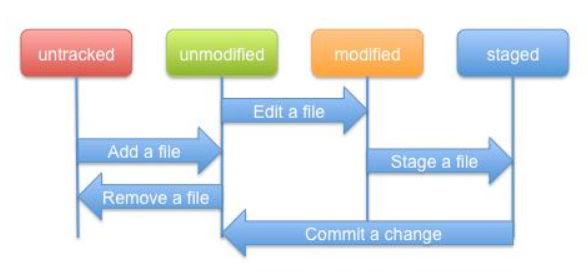

# 一文读懂如何在Windows上使用git

## 1.什么是git

​	   git是一个开源的分布式版本控制系统，可以有效、高速地处理从很小到非常大的项目版本管理。版本控制系统指的是一种记录一个或者若干文件内容变化，以便将来查阅特定版本修订情况的系统。

​	    既然它是一个开源的分布式版本控制系统，那么什么是版本控制系统？它有什么好处呢？举个例子，你完成了一个项目，但是在进行测试的时候发现了一个小bug，当你花了一整天时间，自认为大功告成的时候，却发现软件都无法运行了，于是你非常烦躁，想要回到修改之前的状态，但是自己都不记得改动了哪些地方，于是只有默默的删库跑路。但是如果你使用了git，那就不一样了，它可以很方便的让你保存之前的状态，并在需要的时候还原，这就是版本控制系统的好处了。

​    	那为什么它是分布式呢？分布式是相对于集中式而言，集中式的版本库是集中存放在中央服务器的，干活的时候要先从中央服务器取得最新的版本，然后开始干活，干完活了，再把自己的活推送给中央服务器。可想而知，在网络拥挤的情况下这将会消耗大量的时间，而且中央服务器一旦挂了并且没有备份......分布式版本控制系统中根本没有“中央服务器”，每个人的电脑上都是一个完整的版本库，这样，你工作的时候，就不需要联网了，因为版本库就在你自己的电脑上。既然每个人电脑上都有一个完整的版本库，那多个人如何协作呢？比方说你在自己电脑上改了文件A，你的同事也在他的电脑上改了文件A，这时，你们俩之间只需把各自的修改推送给对方，就可以互相看到对方的修改了。和集中式版本控制系统相比，分布式版本控制系统的安全性要高很多，因为每个人电脑里都有完整的版本库，某一个人的电脑坏掉了不要紧，随便从其他人那里复制一个就可以了。

​		

## 2.下载安装git

### 2.1 下载

​	可以直接在官网下载，但速度比较慢

[Git官网]: https://git-scm.com/downloads/	"界面如下图"

### 2.2 安装

​	下载完成后，就可以对git进行安装了。它安装起来很方便，一路点击Next就可以。打开Git Bash出现下面的界面，恭喜你安装成功了

## 3.git基础

### 3.1git的三种状态

​		想要学好git，必须从它的基础学起。git中的所有文件，只有三种状态，分别是**已修改（modified）**、**已暂存（staged）**和**已提交（committed）**（对于没有加入git控制的文件，可以视为第四种状态，未追踪（Untracked），官方文档中只定义了前三种）

- 已修改表示修改了文件，但还没保存到数据库中。

- 已暂存表示对一个已修改文件的当前版本做了标记，使之包含在下次提交的快照中。

- 已提交表示数据已经安全地保存在本地数据库中。

  git三种状态的文件怎么储存呢？它们都位于同一区域吗？答案是否定的。与之对应的是git的三个阶段，它们分别是工作区、暂存区以及git目录。如下图所示：
  
  
  
  - 工作区：工作区是对项目的某个版本独立提取出来的内容。例如你从github中下载一个项目，那它在文件夹中就属于工作区。
  
  - 暂存区：暂存区一般在git仓库目录中，在git中的专业术语叫做“索引”，它保存了下次要提交的文件信息列表。工作区提交的文件将保存在暂存区。
  
  - git仓库：git仓库是用来保存项目的元数据和对象数据库的地方，它是git中最重要的部分。从其他计算机克隆仓库时，复制的就是这里的数据。
  
    讲了这么多概念，在我们平常使用git时，它们的状态是怎么对应的呢？
  
    ​       如果 Git 目录中保存着特定版本的文件，就属于 已提交 状态。如果文件已修改并放入暂存区，就属于已暂存状态。 如果自上次检出后，作了修改但还没有放到暂存区域，就是 已修改状态。 举个例子，平常在git目录下工作的时候，如果我们新创建一个文件，那它就是属于Untracked状态，修改一个已存在的文件，它将处于Modified状态，它们都属于工作区，也就是说，我们平时工作都是在工作区进行的。当我们执行添加（Add）指令，该文件将被放入暂存区，暂存区的文件可以通过提交（commit）指令将其放入git仓库，这是文件就被稳妥的保存了。

## 4.git使用方法

### 4.1运行git前的配置

## 5.git小技巧

5.1 vim模式下退出

### esc －＞ shift +　＇：＇　－＞　ｗ　－＞　ｑ

