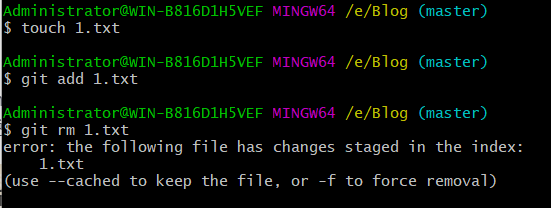

# 一文读懂如何在Windows上使用git

## 1.什么是git

​	   git是一个开源的分布式版本控制系统，可以有效、高速地处理从很小到非常大的项目版本管理。版本控制系统指的是一种记录一个或者若干文件内容变化，以便将来查阅特定版本修订情况的系统。

​	    既然它是一个开源的分布式版本控制系统，那么什么是版本控制系统？它有什么好处呢？举个例子，你完成了一个项目，但是在进行测试的时候发现了一个小bug，当你花了一整天时间，自认为大功告成的时候，却发现软件都无法运行了，于是你非常烦躁，想要回到修改之前的状态，但是自己都不记得改动了哪些地方，于是只有默默的删库跑路。但是如果你使用了git，那就不一样了，它可以很方便的让你保存之前的状态，并在需要的时候还原，这就是版本控制系统的好处了。

​    	那为什么它是分布式呢？分布式是相对于集中式而言，集中式的版本库是集中存放在中央服务器的，干活的时候要先从中央服务器取得最新的版本，然后开始干活，干完活了，再把自己的活推送给中央服务器。可想而知，在网络拥挤的情况下这将会消耗大量的时间，而且中央服务器一旦挂了并且没有备份......分布式版本控制系统中根本没有“中央服务器”，每个人的电脑上都是一个完整的版本库，这样，你工作的时候，就不需要联网了，因为版本库就在你自己的电脑上。既然每个人电脑上都有一个完整的版本库，那多个人如何协作呢？比方说你在自己电脑上改了文件A，你的同事也在他的电脑上改了文件A，这时，你们俩之间只需把各自的修改推送给对方，就可以互相看到对方的修改了。和集中式版本控制系统相比，分布式版本控制系统的安全性要高很多，因为每个人电脑里都有完整的版本库，某一个人的电脑坏掉了不要紧，随便从其他人那里复制一个就可以了。

​		

## 2.下载安装git

### 2.1 下载

​	可以直接在官网下载，但速度比较慢

[Git官网]: https://git-scm.com/downloads/	"界面如下图"


### 2.2 安装

​	下载完成后，就可以对git进行安装了。它安装起来很方便，一路点击Next就可以。打开Git Bash出现下面的界面，恭喜你安装成功了


## 3. git基础

### 3.1 git的三种状态

​		想要学好git，必须从它的基础学起。git中的所有文件，只有三种状态，分别是**已修改（modified）**、**已暂存（staged）**和**已提交（committed）**

- 已修改表示修改了文件，但还没保存到数据库中。

- 已暂存表示对一个已修改文件的当前版本做了标记，使之包含在下次提交的快照中。

- 已提交表示数据已经安全地保存在本地数据库中。

  git三种状态的文件怎么储存呢？它们都位于同一区域吗？答案是否定的。与之对应的是git的三个阶段，它们分别是工作区、暂存区以及git目录。如下图所示：
  
  
  
- 工作区：工作区是对项目的某个版本独立提取出来的内容，放在磁盘上供我们使用。

- 暂存区：暂存区一般在git仓库目录中，在git中的专业术语叫做“索引”，它保存了下次要提交的文件信息列表。工作区添加(add)的文件将保存在暂存区。

- git仓库：git仓库是用来保存项目的元数据和对象数据库的地方，它是git中最重要的部分。从其他计算机克隆仓库时，复制的就是这里的数据。

  讲了这么多概念，在我们平常使用git时，它们的状态是怎么对应的呢？

  ​       如果 Git 目录中保存着特定版本的文件，就属于 已提交 状态。如果文件已修改并放入暂存区，就属于已暂存状态。 如果自上次检出后，作了修改但还没有放到暂存区域，就是 已修改状态。 举个例子，平常在git目录下工作的时候，如果我们新创建一个文件，那它就是属于Untracked状态，修改一个已存在的文件，它将处于Modified状态，它们都属于工作区，也就是说，我们平时工作都是在工作区进行的。当我们执行添加（Add）指令，该文件将被放入暂存区，暂存区的文件可以通过提交（commit）指令将其放入git仓库，这是文件就被稳妥的保存了。

## 4. git使用方法

### 4.1 运行git前的配置

​		git安装完成后，我们需要对它进行系统配置。我刚开始学git的时候，看到很多人配置git都是用

```g
git config --global
```

那为什么要在后面加一个global呢？是不是必须用global？其实不然。在git中，git config是git自带的一个工具，它可以为git的外观和行为配置变量，它包含三个级别的配置，分别是system、global和local,在git中若要配置它们，得在git config指令后传递不同的选项，分别为

```
System:   git config --system
Global:   git config --global
Loacl:	  git config --local
```

- System：系统级别的配置，通常位于git安装目录中的*`/etc/gitconfig`*中，它是系统中每个用户及它们仓库的通用配置。

- Global：用户级别配置，它只针对当前用户生效。一般位于*`C:\Users\当前用户\`*中，可以找到`.gitconfig`文件

- Local：仓库级别的配置，它只针对当前使用的仓库生效，位于当前仓库的*`.git/config`*中

  我们可以在git中通过指令查看所有配置及它们所在的文件：

  ```
  git config --list --show-origin
  ```

  执行结果如下图（退出当前界面点击字母 q）：

  

  

  > tips:tipping_hand_man:：在这些配置中，每个级别的配置会覆盖上一个级别，所以从**优先级角度Local>Global>System**，也就是说，针对同样的某个配置，如果同时存在在local和global中时，local中的配置将会覆盖global中的配置项的值，当然也会同样覆盖system中的配置项；这样做的好处是：既方便共用，又可以个性化自定义。遵循的理念是：对于所有用户都通用的配置项放在system中；对于每个独立的用户相对的共用项放在global;对于某个仓库特殊的配置放在local中。

  接下来我们就可以在git中配置用户名和邮件地址了

  ```
  git config --global user.name "example"
  git config --global user.email "example@xx.com" 
  ```

  配置完成，怎么查看配置信息呢？可以通过`git config --list`找到git所有配置，也可以使用`git config <key>` 来检查git的某一项配置，例如

  ```
  git config user.name
  ```

### 4.2  获取git仓库

​		配置完信息之后，如何获取一个git仓库呢？主要有两种获取的方式：

1. 将尚未进行版本控制的本地目录转为git仓库
2. 从其他服务器**克隆**一个已存在的git仓库

#### 4.2.1 将本地目录转为git仓库

​		如果你有一个项目，还没有进行任何版本控制，但是又想使用git来控制它，此时你应该先进入该项目的目录，然后执行`git init`指令。该指令将创建一个名为`.git`的子目录，这个子目录含有初始化git仓库的所有的必须文件，这些文件是仓库的骨干。但是现在我们仅仅是做了一个初始化操作，项目里面的所有文件都还没有被跟踪。若要跟踪文件，需要使用`git add`指令将其放入暂存区，通过`git commit`指令提交到git仓库，具体指令如下：

```
git add *
git commit -m"init porject version"
```

稍后我们再解释这些具体的指令，现在我们以及得到了一个含有初始文件的git仓库。

> Tips：这与3.1中git的三个阶段相对应

#### 4.2.2 克隆一个已存在的git仓库

​		如果你在逛`GitHub`的时候，看到一个项目非常牛逼，想要把它拷贝下来，这时就要用到`git clone`命令，它克隆的是git仓库服务器上几乎所有的数据，包含每个文件的每个版本。克隆仓库的命令是`git clone <url>`，例如克隆git上`libgit2`的项目，可以使用下面的命令：

```
 git clone https://github.com/libgit2/libgit2
```

这会在当前目录下创建一个名为 `libgit2`”的目录，并在这个目录下初始化一个 `.git` 文件夹， 从远程仓库拉取下所有数据放入 `.git` 文件夹，然后从中读取最新版本的文件的拷贝。 如果你进入到这个新建的 `libgit2` 文件夹，你会发现所有的项目文件已经在里面了，准备就绪等待后续的开发和使用。

> Tips：如果你想在克隆远程仓库的时候，自定义本地仓库的名字，你可以通过额外的参数指定新的目录名：
>
> ```
> git clone https://github.com/libgit2/libgit2 mylibgit
> ```
>
> 这会执行与上一条命令相同的操作，但目标目录名变为了 `mylibgit`。

### 4.3 记录每次更新到仓库

通过上面的操作，我们电脑里面已经有了一个git仓库，并从仓库中检出了所有文件的工作副本。通常我们都会对这些文件进行增、删、改等操作，修改完之后，怎么将它提交到仓库呢？

​	首先我们得记住，在工作目录中的每一个文件不外乎都是这两种工作状态：**已跟踪**和**未跟踪**

- **已跟踪**：已跟踪是指那些被纳入了版本控制的文件，git仓库中有它们的记录。它们可能是**未修改、已修改或已暂存**。比如编辑过某些文件之后，由于自上次提交后你对它们做了修改，Git 将它们标记为已修改文件。 在工作时，你可以选择性地将这些修改过的文件放入暂存区，然后提交所有已暂存的修改，如此反复。
- **未跟踪**：除了已跟踪的文件，其他都属于未跟踪。比如在工作区创建一个文件，仓库中没有任何关于它的记录，所以它属于未跟踪状态。

下面为文件状态变化周期图及解释


- **Untracked**: 未跟踪, 此文件在文件夹中, 但并没有加入到git库, 不参与版本控制. 通过`git add` 状态变为`Staged`
- **Unmodified**: 文件已经入库, 未修改, 即版本库中的文件快照内容与文件夹中完全一致. 这种类型的文件有两种去处, 如果它被修改, 而变为`Modified`. 如果使用`git rm`移出版本库, 则成为`Untracked`文件
- **Modified**: 文件已修改, 仅仅是修改, 并没有进行其他的操作. 这个文件也有两个去处, 通过`git add`可进入暂存`staged`状态, 使用`git checkout` 则丢弃修改过, 返回到`unmodified`状态, 这个`git checkout`即从库中取出文件, 覆盖当前修改
- **Staged**: 暂存状态. 执行`git commit`则将修改同步到库中, 这时库中的文件和本地文件又变为一致, 文件为`Unmodify`状态. 执行`git reset HEAD filename`取消暂存, 文件状态为`Modified`

现在我们通过实际操作来加深对上述知识的理解。

​		首先我们进入到上一节创建的git仓库，执行`git status`指令查看当前文件处于什么状态。


这说明当前的工作目录很干净，所有跟踪的文件在上次提交后都没有更改（如果你的状态不一样，那也没关系，继续看就能够理解）。

​		接下来，我们在当前目录下创建一个*`Readme.txt`*文件，再查看文件状态。


可以看到，现在*`Readme.txt`*处于`Untracked files`下面，这意味着git在之前提交的仓库中没有这个文件，并且也不会自动将它纳入跟踪范围。怎么样才能跟踪管理这个文件呢？很简单，使用`git add` 指令


只要`Changes to be committed`下面的出现这种提示，就说明该文件是处于已暂存的状态

> Tips:tipping_hand_man:：`git add` 后面可以是文件名，也可以是文件夹，如果是文件夹，将递归的跟踪该目录下的所有文件

既然文件已经乖乖待在暂存区了，现在我们要把它放到git仓库里面，这可以通过`git commit`指令来完成，在后面添加 `-m` 选项，后面接上要提交文件的说明。


好，现在你已经创建了第一个提交！ 可以看到，提交后它会告诉你，当前是在哪个分支（`master`）提交的，本次提交的完整 `SHA-1` 校验和是什么（`c3fbc2b`），以及在本次提交中，有多少文件修订过，多少行添加和删改过。

> Tips:tipping_hand_man::提交的是放在暂存区域的文件快照，其他没有放入暂存区的文件即使修改过，但并不会纳入仓库进行版本管理。

如果你觉得先将文件加入暂存区然后再提交有些繁琐，那么可以使用`git commit` 加上 `-a` 选项，此时git会自动把所有已经跟踪过的文件暂存起来一并提交，从而跳过`git add`步骤

### 4.4 git忽略文件

现在我们已经知道怎么将文件放入git仓库了，但有时候项目会生成一些日志文件或者临时文件，这些文件并不需要加入仓库。不加进入还不简单？直接不处理就好了，但是当你查看`git status`的时候未跟踪文件列表里面一直提示这些文件，看着很不舒服。此时我们可以创建一个名为`.gitignore` 的文件，列出要忽略的文件模式，git会根据这些模式规则来判断是否将文件添加到版本控制中。

#### 4.4.1格式规范

- 所有空行或者以 `#` 开头的行都会被 Git 忽略。
- 可以使用标准的 glob 模式匹配，它会递归地应用在整个工作区中。
- 匹配模式可以以（`/`）开头防止递归。
- 匹配模式可以以（`/`）结尾指定目录。
- 要忽略指定模式以外的文件或目录，可以在模式前加上叹号（`!`）取反。

#### 4.4.2 什么是glob模式

所谓的glob模式是值shell所使用的简化了的正则表达式，匹配规则如下：

- `"*"`：星号匹配零个或多个任意字符
-  `[]`：匹配任何一个列在方括号中的字符，如[ab]匹配a或者匹配b
-  `"?"`：问号匹配一个任意字符
-  `[n-m]`：匹配所有在这两个字符范围内的字符，如[0-9]表示匹配所有0到9的数字

#### 4.4.3 匹配示例

```
#忽略所有的 .a 文件
*.a

#跟踪所有的 lib.a ，即使刚刚在忽略了 .a 文件
!lib.a

#只忽略当前目录下的TODO文件，而不忽略其他目录下的TODO文件，例如不忽略subdir/TODO
/TODO

#忽略任何目录下名为build的文件夹
build/

#忽略doc文件夹下的txt文件，但子目录例如doc/server/arch.txt 文件不会被忽略
doc/*.txt

#忽略 doc/ 目录及其所有子目录下的 .txt 文件
doc/**/*.txt

```

> Tips :tipping_hand_man::要养成一开始就为你的新仓库设置好 `.gitignore` 文件的习惯，以免将来误提交这类无用的文件。
>
> 退出git编辑模式的命令为  `‘esc’  然后 shift + ’：‘ ，输入 ’w‘ ’q' ，然后 ‘Enter’`

### 4.5 使用`git diff`查看文件的修改

使用`git status`可以让我们知道文件的状态，但它的输出相对来说过于简略。如果我们想知道具体修改了什么地方，可以使用`git diff`命令，它能够通过文件补丁的格式更加具体地显示哪些行发生了变化。


此命令比较的是工作目录中**当前文件和暂存区域快照之间的差异， 也就是修改之后还没有暂存起来的变化内容。**接下来我们对该图片进行解释

- 第二行中 *a/....    b/....*   其中a和b指的是版本，a版本是变动前的，b版本是变动后的
- 第三行表示两个版本的git哈希值（`13f415b` 和 `689c275`） 最后六位数字是对象的模式（普通文件，644权限）
- 第四、五行   --- 表示变动前的版本， +++ 表示变动后的版本
- 内容部分  -  开头的行是只出现在变动后版本中的内容（比如工作目录中删除了内容），

     ​				+ 开头的行是只出现在变动前版本的行（比如添加内容)

**`git diff --staged`:**查看暂存区和最后一次提交文件的差异（即暂存区和仓库最新版本的差异）

**`git diff --cached`:**和`git diff --staged`同义

**`git diff commit`:**比较工作目录和指定提交（commit）之间的差异。例如要比较工作目录与HEAD指向的提交之间的差异，可以使用 `git diff head`

**`git diff --cached commit`：**比较存储区与指定提交（commit）之间的差异。例如比较存储区与HEAD指向的提交之间的差异，可以使用`git diff --cached head`

**`git diff commit1 commit2`:**比较两个指定提交之间的差异。

### 4.6 删除文件

### 4.6.1 rm

​		该命令用于删除**工作区**文件，暂存区和版本库文件并不会被删除，例如我要删除工作区的*`test.txt`*文件，执行`rm test.txt`，此时git没有出现任何提示，说明你删除成功，查看状态


可以看到，刚才的文件已经提示被删除了，但是还没有进行提交，所以版本库中的文件并没有被删除，要删除版本库中的文件，还需要执行下面语句：

```
git add test.txt
git commit -m"delete test.txt"
```

### 4.6.2 git rm

​		该命令将**删除工作区文件，并将删除放入暂存区**，相当于执行了`rm`指令和`add`指令，若要修改版本库中的内容还需要执行 `git commit`指令进行提交。

### 4.6.3 git rm -f

​		强制删除选项，force的意思，它也是用于删除工作区文件，并将删除放入暂存区。既然作用和`git rm`一样，那为什么还有加一个 `-f` 呢？举个例子，首先我创建一个*`1.txt`*文件，并将它放入暂存区，如果这时我使用git rm指令会怎么样呢？



删除失败，出现了error:x:,这说明删除失败了。为什么不让我们删除呢？因为现在仓库中没有这个文件备份，如果删除了，这个文件将不能被恢复，为了数据的安全，它不允许我们使用普通的删除指令，但是我们可以使用`git rm -f 1.txt`将其强制删除。

​		还有一种情况是假设我们有一个文件*`2.txt`*,它已经存在仓库中，但是我们修改了它的值并且没有提交到仓库，这是也需要使用`git rm -f`指令才能将其删除。

> **tips:tipping_hand_man::如果要删除之前修改过或已经放到暂存区的文件，则必须使用强制删除选项 `-f`**

### 4.6.4 git rm -cache

​		**该指令用于删除暂存区的文件，但是保留工作区文件。**

```
git rm --cache test.txt
git commit -m"delete tets.txt except work directory"
```

### 4.7 移动文件

​		git并不显式跟踪文件移动操作，如果在git中重名了某个文件，git会非常聪明的判断究竟发生了什么。它的具体指令为`git mv`。例如我们创建一个文件夹*`dirTest`*，并将*`1.txt`*移动到里面去，该怎么实现呢？


可以看到，绿色的提示里面也是显示**`renamed`**（重命名），而不是移动，那为什么可以移动呢？这是因为git内部进行了判断。**如果当前目录中存在目标文件夹，文件将被“移动”到目标文件夹，如果不存在，则执行重命名操作。**例如如果刚才的例子中不存在*`dirTest`*文件夹，*`1.txt`*将被重命名为*`dirTest`*。

​		其实，运行`git mv`相当于运行了下面三条命令,它们执行的结果是一样的

```
mv 1.txt dirTest
git add dirTest/1.txt
git rm 1.txt
```

### 4.8 查看提交历史

​		提交了很多次更新，我们想回顾一下提交历史，完成这个任务简单而有效的方法是使用`git log`指令。


正如你所看到的，这个命令会列出每个提交的 `SHA-1` 校验和、作者的名字和电子邮件地址、提交时间以及提交说明。

> tips:tipping_hand_man:：进入log后，点击“Q"键退出，​如果​提交的信息很多，可以使用:arrow_up_small::arrow_down_small:箭头翻页。

`git log -2`:只显示两条日志记录

`git log --pretty=oneline`:单行格式所有日志

`git log --graph`:以”图形化“界面来形象的展示你的分支、合并历史

还有很多用法，具体查看

[官网教程]: https://git-scm.com/book/zh/v2/Git-%E5%9F%BA%E7%A1%80-%E6%9F%A5%E7%9C%8B%E6%8F%90%E4%BA%A4%E5%8E%86%E5%8F%B2

### 4.9 撤销操作

​		在任何一个阶段，我们都可能想要撤销某些操作，值得注意的是，有的撤销操作是不可逆的，操作失误可能导致之前的工作丢失。

#### 4.9.1 撤销本地更改

​		比如在工作区有一个文件*`1.txt`*，它已经被保存在仓库中，后来你在工作区修改了一些*`1.txt`*内容，但最终发现这些内容是不需要变动的，于是你需要回退到之前的版本，这时可以使用`git checkout 1.txt`指令。（如果仓库中不存在该文件的任何信息，使用`checkout`指令将没有任何效果）

#### 4.9.2撤销暂存更改

​		还是前面的1.txt，修改内容后已经提交到暂存区了，这是

#### 4.9.3撤销提交更改

## 5. git小技巧

5.1 vim模式下退出

### esc －＞ shift +　＇：＇　－＞　ｗ　－＞　ｑ


